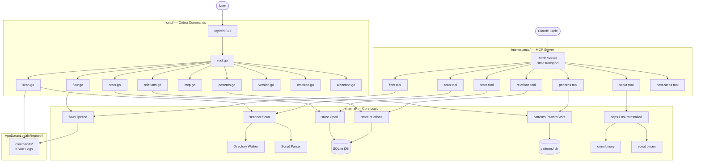
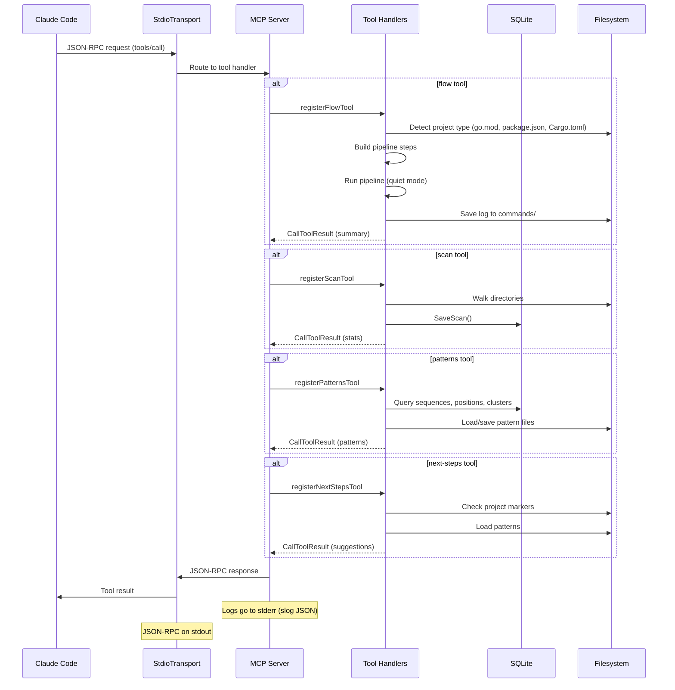
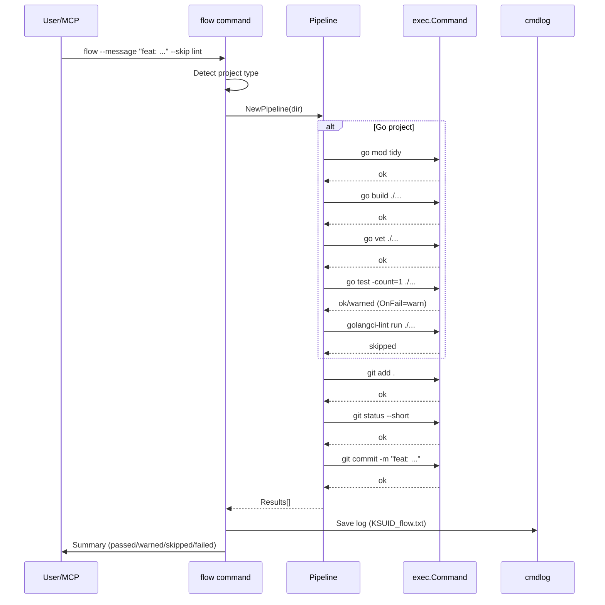
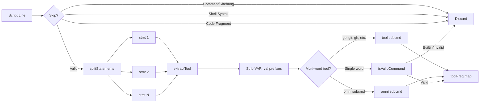
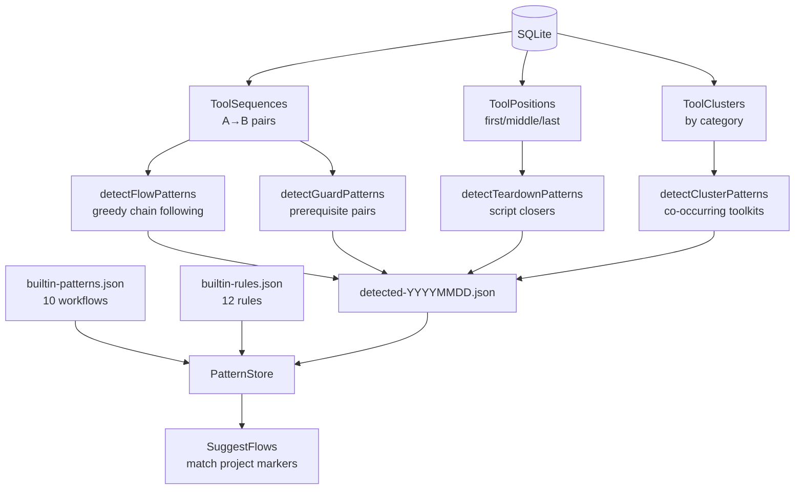
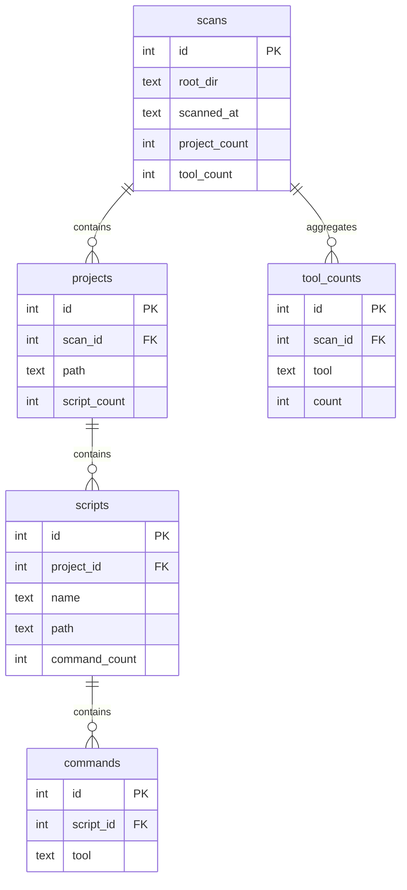

# Architecture

## System Overview



## MCP Server Architecture



## Scan Flow

```mermaid
sequenceDiagram
    participant U as User
    participant C as scan command
    participant S as scanner.Scan
    participant DB as SQLite
    participant FS as Filesystem

    U->>C: repited scan /path --depth 3 --top 20
    C->>S: Scan(dir, maxDepth)

    loop Walk directory tree
        S->>FS: WalkDir (skip hidden, enforce depth)
        FS-->>S: Directory entry
        S->>FS: Check .git exists?
        S->>FS: Check .scripts exists?

        alt Both exist
            S->>FS: ReadDir(.scripts)
            FS-->>S: Script file list

            loop Each .sh file
                S->>S: extractCommands(path)
                S->>S: splitStatements (&&, ||, ;, |)
                S->>S: extractTool (identify command name)
                S->>S: Aggregate in toolFreq map
            end

            S->>S: SkipDir (don't descend further)
        end
    end

    S-->>C: ScanResult{Projects, ToolCounts}
    C->>DB: SaveScan (transaction with prepared stmts)
    C->>U: Print ranked tool table with bars
```

## Flow Pipeline



## Command Parser Pipeline



## Pattern Detection



## Data Model


